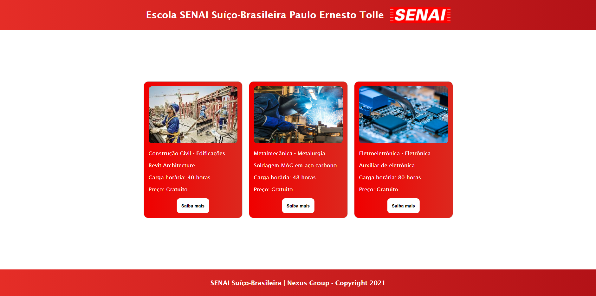

<h1 align="center">Site_Senai</h1>
 <h4 align="center"> 
	🚧  Site_Senai 🚀 Completo ✅
</h4>

Site feito para estudo de NodeJS usando o Site do Senai como base 

 Projeto organizado no trello usando o metodo kanban pelo grupo Nexus 

Tabela de conteúdos
=================
<!--ts-->
   * Pré-Requisitos
   * Tecnologias
   * Site
   * Contribuidores 
<!--te-->

### Pré-requisitos

Antes de começar, você irá precisar ter instalado em sua máquina a seguinte ferramenta:
[Git](https://git-scm.com). 
Além disto é recomendável utilizar um editor para trabalhar com o código como [VSCode](https://code.visualstudio.com/)
E tambem foi usado o [NodeJS](https://nodejs.org/pt-br/download/)

### 🛠 Tecnologias

As seguintes ferramentas foram usadas na construção do projeto:

- HTML
- CSS
- JavaScript
- NodeJS

## Site 

<h1 align="center">
  
</h1>

## 👨‍💻 Contribuidores

Vitor Benedito - Paulo Rondon -
Paulo Willyan - Marcos Arambasic -
Matheus Costa - Matheus Reis
